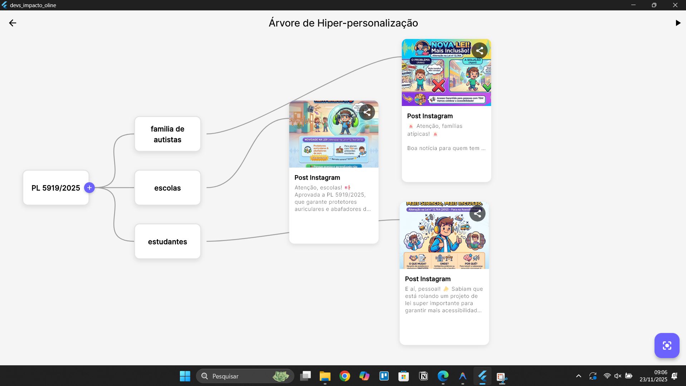
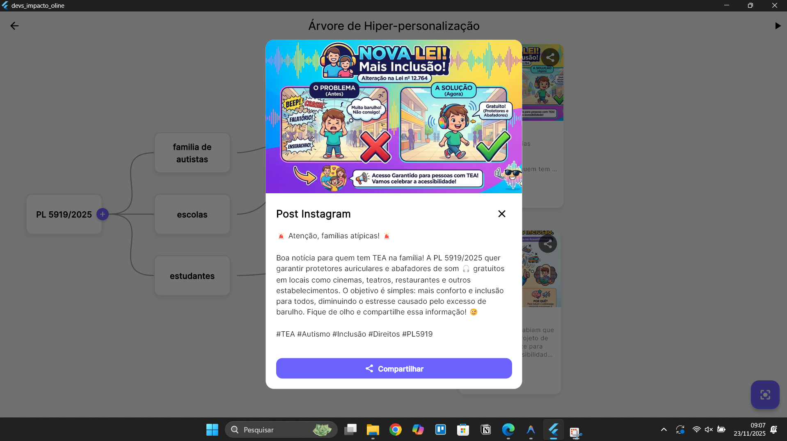

# Devs Impacto Online 🚀

Aplicativo desenvolvido para democratizar o acesso à informação legislativa, transformando leis complexas em posts de redes sociais engajadores e acessíveis utilizando Inteligência Artificial.

## 🛠️ Tecnologias Utilizadas

*   **Flutter**: Framework principal para desenvolvimento multiplataforma.
*   **Google Gemini AI**:
    *   `gemini-2.0-flash`: Geração de textos explicativos e análise de PDFs (Inteiro Teor das leis).
    *   `gemini-2.5-flash-image`: Geração de imagens ilustrativas para os posts.
*   **Supabase**:
    *   **Auth**: Sistema de autenticação (Login/Cadastro).
    *   **Database**: Armazenamento do histórico de posts gerados.
    *   **Storage**: Hospedagem das imagens geradas.
*   **API da Câmara dos Deputados**: Fonte oficial de dados das proposições legislativas.

## 📦 Principais Pacotes

*   `provider`: Gerenciamento de estado.
*   `flutter_dotenv`: Gerenciamento de variáveis de ambiente.
*   `share_plus`: Compartilhamento nativo para Instagram e outras redes.
*   `http`: Requisições API.
*   `google_fonts`: Tipografia moderna.

## 🚀 Como Rodar o Projeto

### Pré-requisitos
*   Flutter SDK instalado.
*   Conta no [Supabase](https://supabase.com/) (para Auth e DB).
*   Chave de API do [Google AI Studio](https://aistudio.google.com/) (Gemini).

### Passo a Passo

1. **Clone o repositório**
   ```bash
   git clone https://github.com/devmatheusoliveira/civicux_creator/
   cd civicux_creator
   ```

2. **Configure as Variáveis de Ambiente**
   Crie um arquivo chamado `.env` na raiz do projeto e adicione suas chaves de configuração. Este passo é **obrigatório** para o funcionamento da IA e do Login.

   ```env
   # Google Gemini AI
   GEMINI_API_KEY=sua_chave_aqui

   # Supabase Configuration
   SUPABASE_URL=sua_url_supabase
   SUPABASE_ANON_KEY=sua_chave_anonima_supabase
   ```

   > **⚠️ Importante:** O arquivo `.env` contém dados sensíveis e está listado no `.gitignore`, portanto não é versionado. Você deve criar o seu localmente.

3. **Instale as dependências**
   ```bash
   flutter pub get
   ```

4. **Execute o projeto**
   ```bash
   flutter run
   ```

## 📱 Funcionalidades

1. **Feed de Leis**: Visualize as últimas proposições da Câmara dos Deputados na tela inicial.
2. **Árvore de Hiper-personalização AI**:
   *   Selecione uma lei.
   *   Crie ramificações para diferentes públicos-alvo.
   *   A IA analisa o PDF oficial da lei (Inteiro Teor) e gera um post (Texto + Imagem) adaptado especificamente para aquele público.
3. **Compartilhamento**: Envie o post gerado (Imagem + Legenda) diretamente para o Instagram Stories, Feed ou WhatsApp.
4. **Histórico na Nuvem**: Todos os posts gerados são salvos automaticamente no banco de dados do Supabase.

## 🌳 Árvore de Hiper-personalização

A **Árvore de Hiper-personalização** é o coração do projeto. Ela permite desdobrar uma lei complexa em comunicações específicas para diferentes grupos da sociedade.

### Como funciona:
1.  **Nó Raiz**: Representa o Projeto de Lei selecionado.
2.  **Ramificações**: O usuário cria "nós" filhos representando públicos-alvo (ex: "Estudantes", "Pequenos Empresários", "Aposentados").
3.  **Geração AI**: Ao clicar no "Play", a IA analisa o texto integral da lei e gera um post (imagem + legenda) único para cada público final.


*Exemplo de uma árvore com ramificações para diferentes públicos.*


*Exemplo de post gerado automaticamente pela IA.*

---
## 📄 Licença

Este projeto está sob a licença MIT. Veja o arquivo [LICENSE](LICENSE) para mais detalhes.

Desenvolvido durante o Hackathon Devs de Impacto.
